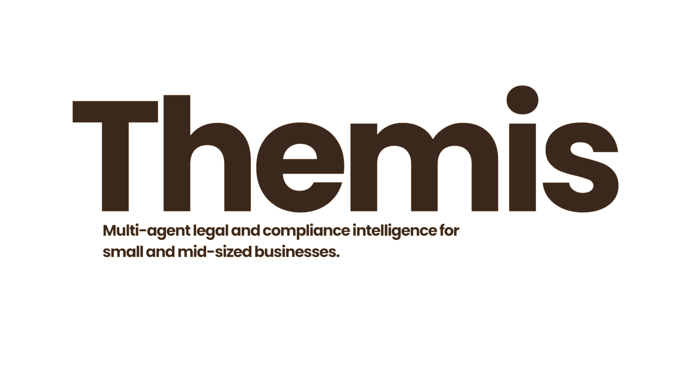

<div align="center">
  
</div>

<div align="center">

**Multi-agent legal and compliance intelligence for small and mid-sized businesses.**

[Architecture](#architecture) · [Tech Stack](#tech-stack) · [Getting Started](#getting-started) · [Repository Structure](#repository-structure) · [Roadmap](#roadmap)

</div>

---

## Overview

Themis analyzes commercial contracts and surfaces risk in language a business owner can act on, without requiring a legal team for every routine review. It combines retrieval-grounded reasoning, atomic fact verification, and persistent portfolio memory to produce assessments that are explainable, source-traceable, and consistent across a client's full contract history.

The system is designed around a single constraint that shapes every architectural decision: **a wrong claim in this domain has real financial consequences, so nothing is surfaced to a user without a verifiable source.**

Core capabilities:

- **Jurisdiction-aware analysis** — contracts are routed to the correct legal corpus based on governing-law detection, with the retrieval layer architected to extend to additional jurisdictions without structural changes.
- **Atomic fact verification** — every claim the system makes is decomposed into individual assertions and checked against retrieved source text before being shown to a user, preventing compounding error across multi-step reasoning.
- **Knowledge graph memory** — contract entities, obligations, and counterparties are modeled as a graph, enabling cross-document portfolio queries that vector search alone cannot answer (for example, every active agreement with a given counterparty that contains an auto-renewal clause).
- **Negotiation simulation** — an adversarial two-agent exchange models likely counterparty pushback on proposed redlines before a user sends them.
- **Regulatory monitoring** — a background process cross-references tracked regulatory changes against a client's active contract portfolio and flags affected clauses proactively.
- **Human-in-the-loop by design** — the system flags and explains; it does not adjudicate. High-risk or low-confidence outputs are routed to a human review queue rather than resolved autonomously.

---

## Architecture

Themis is built as a stateful multi-agent graph, not a linear pipeline. Verification and negotiation both require cycles — re-checking a claim, or exchanging redlines back and forth — which a single-pass chain cannot represent.

```
PDF Upload
    │
    ▼
┌──────────────────────────────────────────────────────┐
│                  LangGraph State Machine              │
│                                                        │
│   1. Jurisdiction Classifier                          │
│              │                                        │
│   2. Extraction Agent                                 │
│              │                                        │
│   3. Risk Analysis Agent            (retrieval-grounded)│
│              │                                        │
│   4. Atomic Verification Agent      (interrupt_before) │
│              │                       human review gate  │
│   5. Knowledge Graph Writer                           │
│              │                                        │
│   6. Negotiation Simulation         (cyclic exchange)  │
│                                                        │
│   7. Regulatory Monitoring          (background)       │
│   8. Critic / Feedback Loop         (correction log)   │
└──────────────────────────────────────────────────────┘
    │
    ▼
FastAPI  →  React Client
```

Every agent boundary enforces a validated schema rather than passing free text downstream, and every tool is exposed as an MCP server rather than a framework-specific wrapper, so the tool layer remains portable across clients.

---

## Tech Stack

| Layer | Technology | Rationale |
|---|---|---|
| Orchestration | LangGraph | Native support for cycles, checkpointed state, and human-in-the-loop interrupts |
| Schema enforcement | PydanticAI | Validated, typed output at every agent boundary |
| Tool layer | Model Context Protocol (MCP) | Protocol-standard tool exposure, not locked to a single framework |
| Vector retrieval | Qdrant | Clause and statute corpus retrieval |
| Graph memory | Neo4j | Cross-document, relationship-level portfolio queries |
| Local inference | Ollama | Low-cost, private inference for routine classification and extraction |
| Complex reasoning | Claude (Anthropic API) | Reserved for risk analysis, verification, and negotiation simulation |
| PII handling | Microsoft Presidio | Redaction pass prior to any external model call |
| Observability | Langfuse (self-hosted) | Full trace visibility; no third-party storage of sensitive contract data |
| Evaluation | Ragas | Quantified RAG quality metrics on the verification layer |
| Workflow automation | n8n | Deadline reminders, regulatory alerts, escalation routing |
| Backend | FastAPI | Multi-tenant API, JWT-scoped tenant isolation |
| Frontend | React + Vite | Contract viewer, portfolio risk dashboard, negotiation transcript view |
| Infrastructure | Docker, Kubernetes, Terraform, GitHub Actions | Containerized services, IaC-provisioned environments, automated CI/CD |

---

## Getting Started

### Prerequisites

- Docker Desktop
- Python 3.12+
- An Anthropic API key

### Local setup

```bash
git clone <repository-url>
cd themis

cp .env.example .env
# populate .env with your ANTHROPIC_API_KEY and generated credentials

docker compose up -d

# pull local models (first run only)
docker compose exec ollama ollama pull llama3.1:8b
docker compose exec ollama ollama pull nomic-embed-text

pip install -e ".[api,dev]"
python -m spacy download en_core_web_lg

pre-commit install

pytest tests/unit/ -v
```

### Local service endpoints

| Service | URL |
|---|---|
| API (Swagger) | http://localhost:8000/docs |
| Qdrant dashboard | http://localhost:6333/dashboard |
| Neo4j browser | http://localhost:7474 |
| Langfuse | http://localhost:3000 |
| n8n | http://localhost:5678 |
| Ollama | http://localhost:11434 |

---

## Repository Structure

```
themis/
├── agents/          Agent node implementations
├── graph/           StateGraph definition, shared state, routing logic
├── schemas/         PydanticAI models for agent boundaries
├── retrieval/       Qdrant and Neo4j abstractions, corpus loaders
├── tools/mcp/       MCP server implementations
├── api/             FastAPI application, routers, middleware
├── observability/   Langfuse tracing integration
├── eval/            Ragas evaluation suite
├── automation/      n8n workflow definitions
├── frontend/        React client
├── infra/           Terraform and Kubernetes manifests
└── tests/           Unit and integration tests
```

Full component-level detail — phases, dependencies, design decisions, and open questions — is maintained in the project wiki.

---

## Roadmap

| Phase | Scope | Status |
|---|---|---|
| 0 | Infrastructure skeleton, CI baseline | Complete |
| 1 | Core agent loop, end to end | In progress |
| 2 | Retrieval layer (Qdrant, Neo4j, corpus ingestion) | Planned |
| 3 | Verification, knowledge graph writer, negotiation, monitoring agents | Planned |
| 4 | Frontend and API hardening | Planned |
| 5 | Observability, evaluation, workflow automation | Planned |
| 6 | Kubernetes deployment, Terraform, CI/CD pipeline | Planned |

---

## Design Principles

- **Verifiability over fluency.** No claim is surfaced without a traceable source. Where confidence is insufficient, the system defers to human review rather than producing a plausible-sounding answer.
- **Bounded autonomy.** Agents propose and flag; they do not execute irreversible actions without explicit approval.
- **Multi-tenant isolation by construction.** Vector collections and graph queries are scoped per tenant and jurisdiction at every layer of the stack, not enforced only at the API boundary.

---

## License

Distributed under the MIT License. See `LICENSE` for details.
